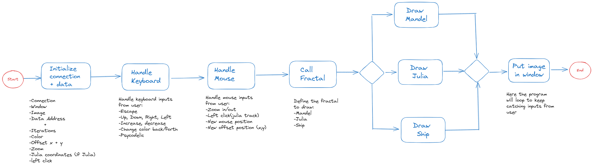

# Fract-ol

This project is about to draw some beautiful fractals in the screen, during this project you will learn: how do computers process images and displays in screen, how to work with the `Minilibx` library, how to define data structures in order to represent complex numbers, among others. 

## How do computers process images?

The pixel is the basic unit of programmable color on a computer display or in a computer image (Think of it as a logical rather than a physical unit). Pixels are the smallest unit in a digital display. Each pixel comprises a subpixel that emits a red, green, blue (RGB) color, which displays at different intensities.

## Drawing with Minilibx 🖌️🖌️🖌️

Minilibx is a tiny graphics library which allows you to do the most basic things for rendering something in screens without any knowledge of X-window. It provides window creation, a drawing tool, image functions and event management system. 

To work with Minilibx we need to include the `mlx.h` header to access all the functions and we should execute the `mlx_init` function. This will establish a connection to the correct graphical system and will return a pointer `void *` which holds the location of our current MLX instance. 

`#include <mlx.h>`

To create a new window you need to use the function `mlx_new_window` this will return a pointer to the window we have just created. In order to have the window rendering, I need to put it in a loop, this can be done with the `mlx_loop` function

### Writing pixels to an image

Pushing pixels to the window can be tricky sometimes, one of the optimized way of doing so. 

The function `mlx_pixel_put` is very slow, because it tries to push the pixel instantly to the window (without waiting for the frame to be entirely rendered). Because of this simple reason, we will have to buffer all of our pixels to an image, which we will then push to the window. 

To initiate an image to `mlx` we need to pass a few pointers to which it will write a few variables: 

`bits_per_pixel`

`line_length` 

`endian`

Now we have the image address, but still no pixels. Before we start with this, we must understand that the bytes are not aligned, this means that the `line_length` differs from the actual window width. We therefore should ALWAYS calculate the memory offset using the line length set by `mlx_get_data_addr`

Once you know where to write , it becomes easy to write a function to mimic the behaviour of `mlx_put_pixel` but will be faster 

So the workflow will be something like: 

1. Create variables (1 for the connection `mlx`, 1 for the window `mlx_win`)
2. Initialize the connection `mlx = mlx_init( );`
3. Create the window `mlx_win = mlx_nex_window(mlx, 1920, 1080, “hello world!”);`
4. Create the image `img.img = mlx_new_image(mlx, 1920, 1080);`
5. get the image address `img.addr = mlx_get_data_addr(img.img, &img.bits_per_pixel, &img.line_length, &img.endian);`
6. call the put pixel function `my_mlx_pixel_put(&img, 5 , 5, 0x00FF0000);` 
7. put image in window `mlx_put_image_to_window(mlx, mlx_win, img.img, 0, 0);`
8. loop to render `mlx_loop(mlx);`

## Working with structures

In C a struct (or structure) is a collection of variables (can be of different types) under a single name. Before I can create structure variables, I need to define its data type. To define a struct the `struct` keyword is used. When a struct type is declared, no storage or memory is allocated. To allocate memory of a given structure type and work with it, we need to create variables. 

***Access Members of structure*** 

To access to the members of structures I can use two type of operators: 

1. `.` Member operator
2. `→` structure pointer operator

Suppose that want to access the salary of person2. You do something like: 

`person2.salary` 

### Events handling

To work with events we need to get familiar with the codes of key input and mouse input

`cat /usr/include/X11/keysymdef.h` —> Here we can get familiar wit it

### Doing the thing 🤯🤯 👾👾 👨‍🎨👨‍🎨

